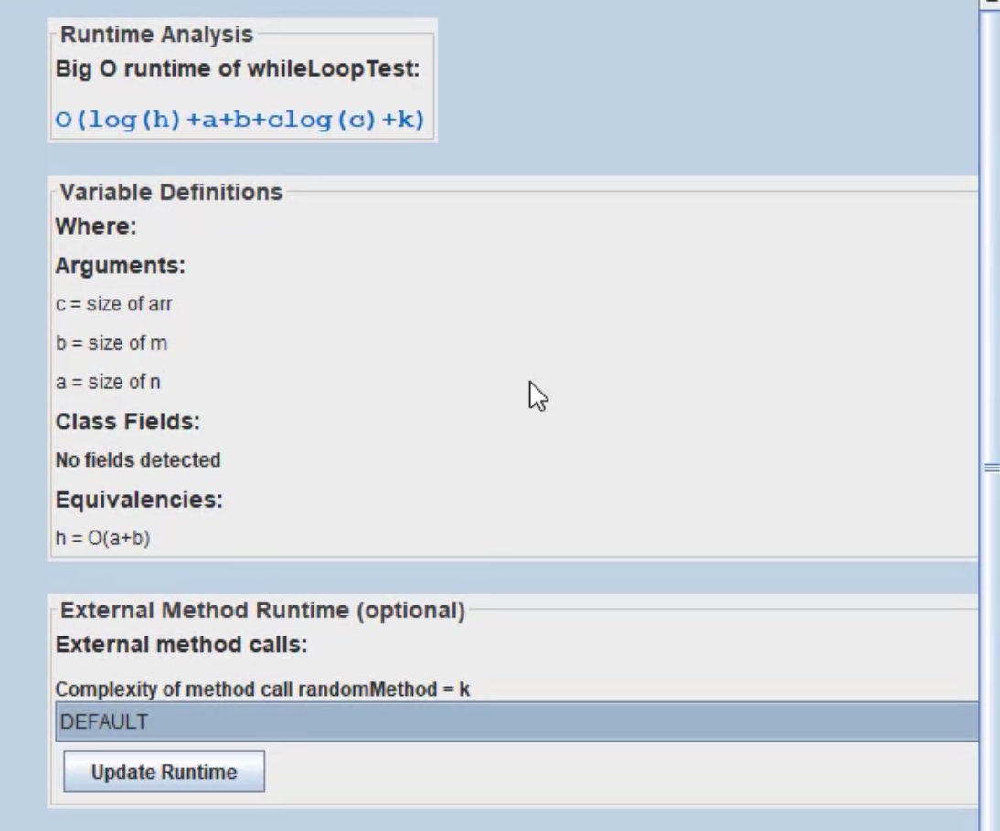
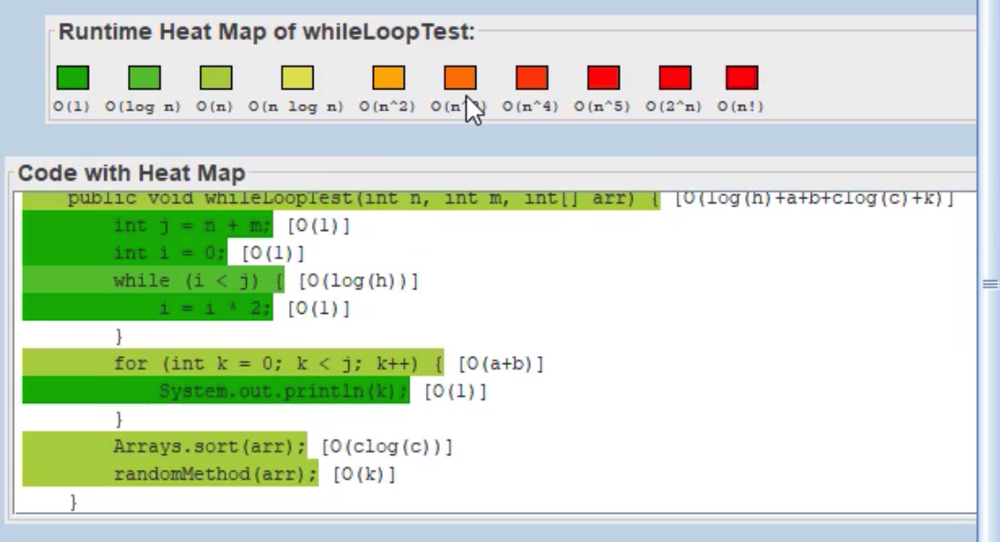
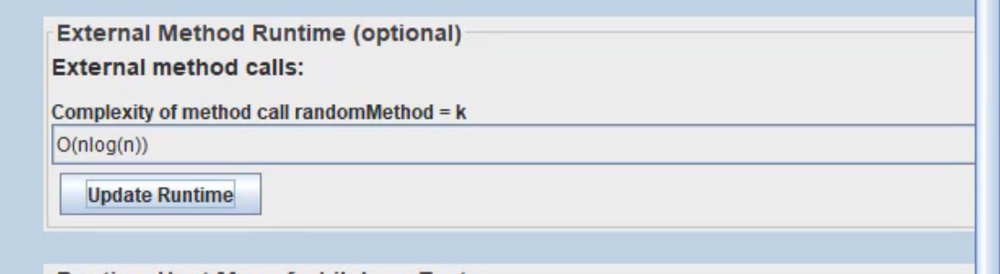
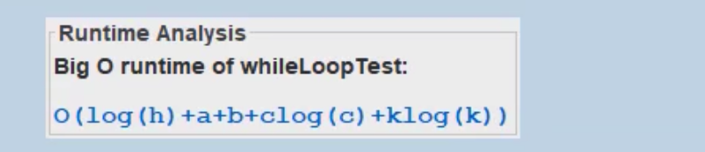
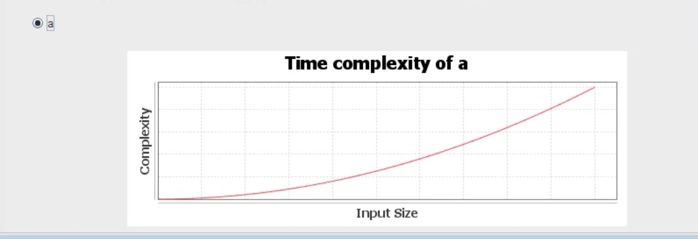

# Quick start guide

Welcome to Big O analyzer, a tool specialized for performing static Big O analyses on Java code. We intend this tool to be used by computer science students/beginning developers who are interested in which parts of their code contribute to the majority of its runtime.

This tool first allows you to upload a Java class file from one of your projects. This is fairly straightforward, as shown:

From here, you will be given a dropdown, which allows you to choose which method within the class you'd like to analyze.
The tool will then calculate its worst-case Big O time complexity with respect to the method's arguments and the class' fields, as well as any defined equivalencies. 
Moreover, it visualizes the time complexities of each of the method's lines, including any encapsulating statements and loops. 
Here is an example output:

Naturally, since our program can only access one class file, there may be some referenced methods that cannot be identified. To minimize such occurrences, our tool can identify most library methods for numbers, booleans, strings, arrays, arrayLists, and linkedLists and return their time complexities. 
But if there is an external, non-library method, our tool assigns a new variable as the time complexity of this method. It also provides a dropdown (below) that allows the user to assign a time complexity to this method, updating the parent method's time complexity in the process.

Furthermore, the user can see how the time complexity of the input method is expected to scale as one of the variables in its Big O equation changes (below).

Since this tool is a static analyzer, it has some limitations. It has to make many approximations, particularly when handling loops and statements. For instance, we deem an if/else statement's time complexity to be the slowest option out of all its branches.
In practice, an analyzed method's true runtime will likely be faster than what this program suggests.
In addition, we advise that you ensure your code works as intended before analyzing it. Beyond syntax violations, this tool is not meant to detect whether your code can execute error-free.